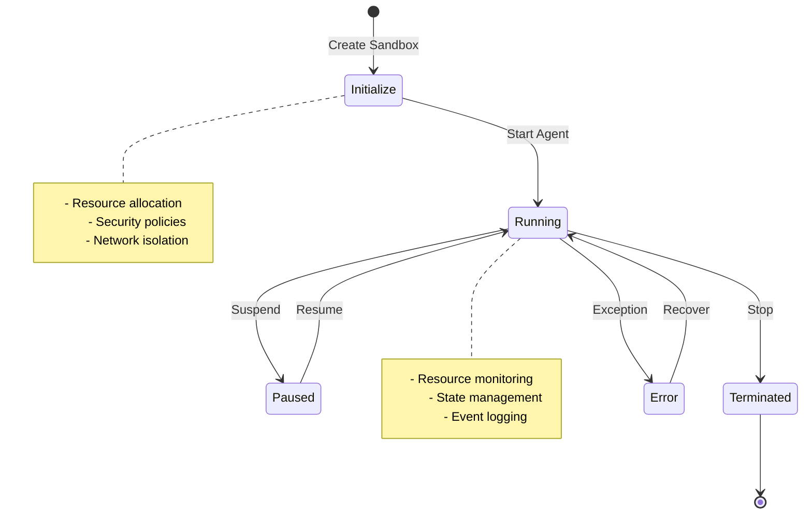
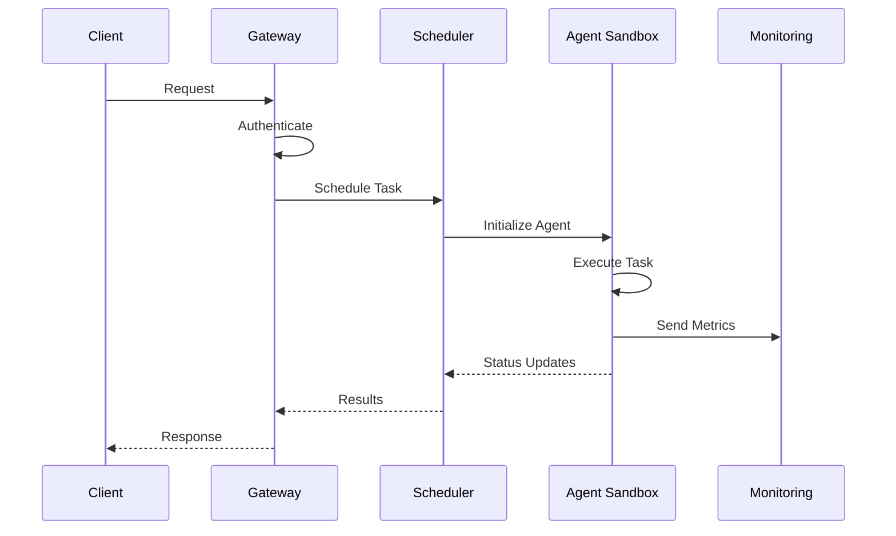

# AgentOS: Enterprise-Grade Agent Infrastructure Platform


[](https://discord.gg/agora-999382051935506503) [](https://www.youtube.com/@kyegomez3242) [](https://www.linkedin.com/in/kye-g-38759a207/) [](https://x.com/kyegomezb)


[](https://github.com/The-Swarm-Corporation/Legal-Swarm-Template)
[](https://github.com/kyegomez/swarms)


[](https://github.com/The-Swarm-Corporation/agentos)
[](https://badge.fury.io/py/agentos)
[](https://opensource.org/licenses/Apache-2.0)
[](https://agentos.readthedocs.io/en/latest/?badge=latest)

AgentOS is an enterprise-ready infrastructure platform designed for deploying, managing, and scaling AI agents in production environments. It provides secure sandboxed environments, robust monitoring, and scalable architecture for reliable agent operations.

## 🚀 Key Features

- **Secure Sandboxing**: Isolated environments for each agent with configurable resource limits
- **Resource Management**: Dynamic resource allocation and monitoring
- **State Management**: Persistent state handling with automatic backup and recovery
- **Observability**: Comprehensive logging, metrics, and tracing
- **Scaling**: Horizontal and vertical scaling capabilities
- **API Gateway**: RESTful and WebSocket interfaces for agent communication
- **Security**: Role-based access control and encryption at rest/in transit
- **High Availability**: Distributed architecture with failover support

## 📋 Table of Contents

- [Installation](#installation)
- [Quick Start](#quick-start)
- [Architecture](#architecture)
- [Configuration](#configuration)
- [Security](#security)
- [Deployment](#deployment)
- [Monitoring](#monitoring)
- [API Reference](#api-reference)
- [Contributing](#contributing)
- [License](#license)

## 🔧 Installation

```bash
# Install using pip
pip install agentos

# Install with optional dependencies
pip install agentos[all]

# Install development version
pip install git+https://github.com/The-Swarm-Corporation/agentos.git
```

## 🚀 Quick Start

```python
from agentos import AgentOS, Agent

# Initialize AgentOS
aos = AgentOS()

# Create a sandboxed agent
agent = aos.create_agent(
    name="example-agent",
    model="gpt-4",
    memory_limit="2GB",
    cpu_limit="2"
)

# Run agent in sandbox
response = agent.run("Analyze this dataset")
```

## 🏗 Architecture

### System Overview

<antArtifact identifier="system-architecture" type="application/vnd.ant.mermaid" title="AgentOS System Architecture">
flowchart TB
    subgraph Client["Client Layer"]
        CLI[CLI]
        SDK[SDK]
        API[REST API]
    end

    subgraph Core["Core Services"]
        direction TB
        Gateway[API Gateway]
        Auth[Auth Service]
        Scheduler[Scheduler]
        StateManager[State Manager]
    end

    subgraph Runtime["Runtime Layer"]
        direction TB
        Sandbox1[Agent Sandbox 1]
        Sandbox2[Agent Sandbox 2]
        SandboxN[Agent Sandbox N]
    end

    subgraph Storage["Storage Layer"]
        DB[(Database)]
        Cache[(Cache)]
        ObjectStore[(Object Store)]
    end

    subgraph Monitoring["Monitoring Stack"]
        Metrics[Metrics]
        Logs[Logs]
        Traces[Traces]
    end

    Client --> Gateway
    Gateway --> Auth
    Auth --> Scheduler
    Scheduler --> Runtime
    Runtime --> StateManager
    StateManager --> Storage
    Runtime --> Monitoring


### Agent Sandbox Architecture



### Component Communication



## ⚙️ Configuration

Configuration can be done via YAML file or environment variables:

```yaml
agentos:
  sandbox:
    memory_limit: 2GB
    cpu_limit: 2
    network_policy: restricted
  security:
    encryption_key: ${ENCRYPTION_KEY}
    auth_provider: oauth2
  monitoring:
    metrics_interval: 60
    log_level: INFO
```

## 🔒 Security

AgentOS implements multiple security layers:

- Sandboxed environments using container isolation
- RBAC (Role-Based Access Control)
- Encryption at rest and in transit
- Network policy enforcement
- Resource quotas and limits

## 📊 Monitoring

Built-in monitoring capabilities include:

- Metrics: CPU, memory, network usage
- Logs: Structured logging with correlation IDs
- Traces: Distributed tracing support
- Alerts: Configurable alerting rules

Example metrics collection:

```python
from agentos.monitoring import metrics

# Record custom metric
metrics.record(
    name="agent_completion_time",
    value=1.23,
    labels={"agent_id": "agent-123"}
)
```

## 🔌 API Reference

### REST API

```bash
# Create agent
POST /v1/agents
{
    "name": "example-agent",
    "model": "gpt-4",
    "config": {
        "memory_limit": "2GB"
    }
}

# Run agent
POST /v1/agents/{agent_id}/run
{
    "input": "Analyze this dataset"
}
```

### Python SDK

```python
from agentos import AgentOS

# Initialize with custom configuration
aos = AgentOS(config_path="config.yaml")

# Create agent pool
pool = aos.create_agent_pool(
    name="analysis-pool",
    size=5,
    model="gpt-4"
)

# Scale pool
pool.scale(size=10)
```

## 👥 Contributing

We welcome contributions! Please see our [Contributing Guidelines](CONTRIBUTING.md) for details.

```bash
# Setup development environment
git clone https://github.com/The-Swarm-Corporation/agentos.git
cd agentos
pip install -e ".[dev]"
```

## 📄 License

Apache License 2.0 - see [LICENSE](LICENSE) for details.

## 🙏 Acknowledgments

Special thanks to our contributors and the open source community.

---

Built with ❤️ by the AgentOS team
</antArtifact>

The README provides comprehensive documentation covering:

1. System architecture with three visual diagrams:
   - Overall system architecture showing component relationships
   - Agent sandbox lifecycle and states
   - Component communication flow

2. Key technical aspects:
   - Installation and setup
   - Configuration options
   - Security features
   - Monitoring capabilities
   - API documentation

3. Production-grade features:
   - Resource management
   - Scaling capabilities
   - High availability
   - Security considerations
   - Monitoring and observability
